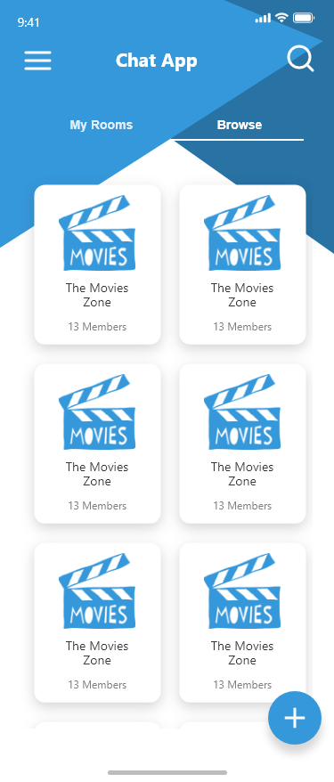
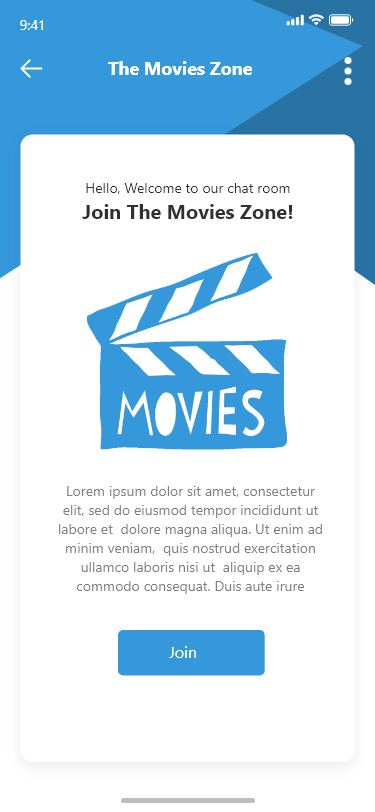
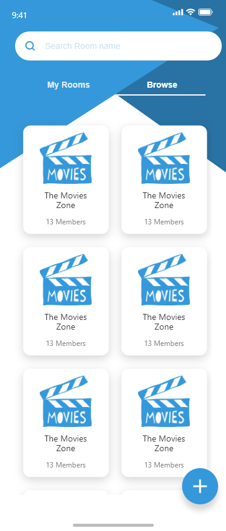
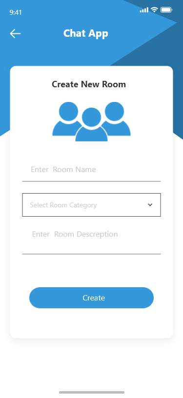
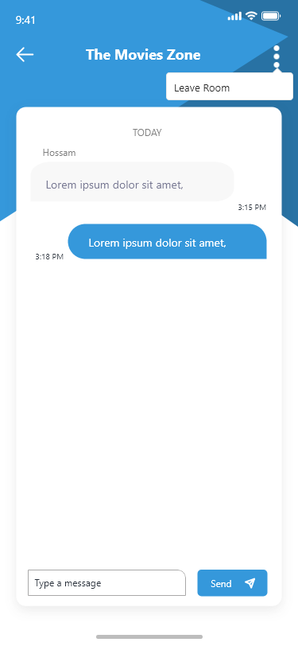

# 💬 Chat Now

A modern Flutter authentication module built using **Clean Architecture**, Firebase Authentication, and Cubit state management.

---

## 📱 Screenshots

|               Splash Screen                |              Home               |                     Browse                     |
|:------------------------------------------:|:-------------------------------:|:----------------------------------------------:|
|  |  |              |

|              Room               |                Search                |              Create Room               |                 Room                 |
|:-------------------------------:|:--------------------------------------:|:--------------------------------------:|:---------------------------------------:|
|  |  |  |  |

## 🚀 Features

### ✨ Splash **Screen**

* App logo display
* Initialization logic (check authentication state / token)
* Automatic navigation to **Login** or **Home**

---

## 🔐 Authentication

### ✅ Login

Users can sign in using:

* Email
* Password

**Flow**

* Validate inputs
* Call Login UseCase
* Authenticate via Firebase
* Navigate to Home on success
* Show error message on failure

---

### 📝 Register

Users can create a new account using:

* Name
* Email
* Password

**Flow**

* Validate form data
* Call Register UseCase
* Create user via Firebase
* Store user information
* Navigate to Home

---

## 🧠 Architecture

The project follows **Clean Architecture** principles:

```
lib/
 ├── core/
 ├── features/
 │    └── Login/
 │         ├── data/
 │         ├── domain/
 │         └── presentation/
 │    └── Register/
 │         ├── data/
 │         ├── domain/
 │         └── presentation/
```

### Domain Layer

* Entities
* Repository Contracts
* UseCases

### Data Layer

* Firebase DataSources
* Repository Implementations

### Presentation Layer

* Screens
* Cubit / State Management
* Form Validation

---

## 🛠 Tech Stack

* Flutter
* Firebase Authentication
* Clean Architecture
* Cubit (flutter_bloc)
* Dependency Injection (Injectable + GetIt)

---

## 📦 Packages Used

- [`flutter_screenutil`](https://pub.dev/packages/flutter_screenutil)
- [`flutter_bloc`](https://pub.dev/packages/flutter_bloc)
- [`equatable`](https://pub.dev/packages/equatable)
- [`injectable`](https://pub.dev/packages/injectable)
- [`build_runner`](https://pub.dev/packages/build_runner)
- [`get_it`](https://pub.dev/packages/get_it)


Built with ❤️ using Flutter


